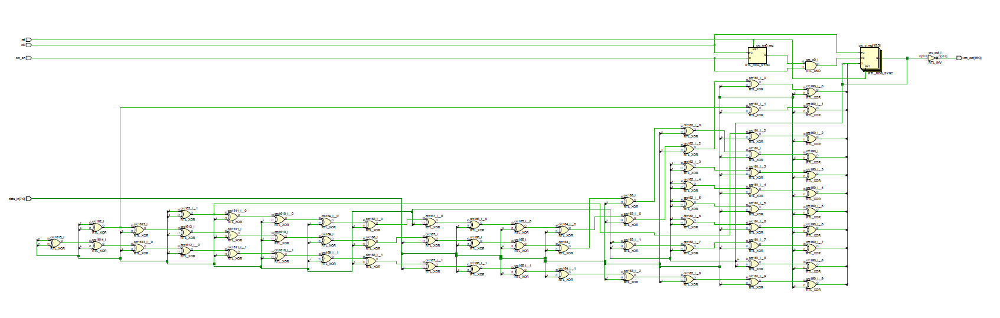
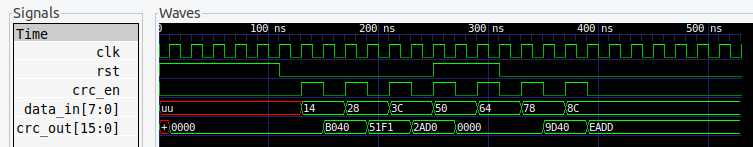
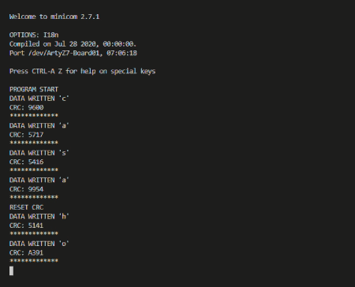

# CRC16 para lectura por UART

Se implementó un modulo CRC de 16 bits y una aplicación que recibe bytes por UART y calcula el CRC16 de la cadena ingresada

## Esquematico

## Simulaciones

### Uso de aplicación

la aplicación recibe caracteres ascii por uart y muestra el CRC calculado con la cadena de ascii que esta recibiendo.

